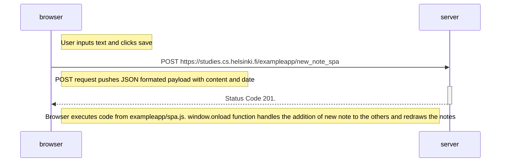

```mermaid
sequenceDiagram
    participant browser
    participant server

    Note right of browser: User inputs text and clicks save
    browser->>server: POST https://studies.cs.helsinki.fi/exampleapp/new_note_spa
    Note right of browser: POST request pushes JSON formated payload with content and date
    activate server
    server-->>browser: Status Code 201.
    deactivate server
    Note right of browser: Browser executes code from exampleapp/spa.js. window.onload function handles the addition of new note to the others and redraws the notes
```
